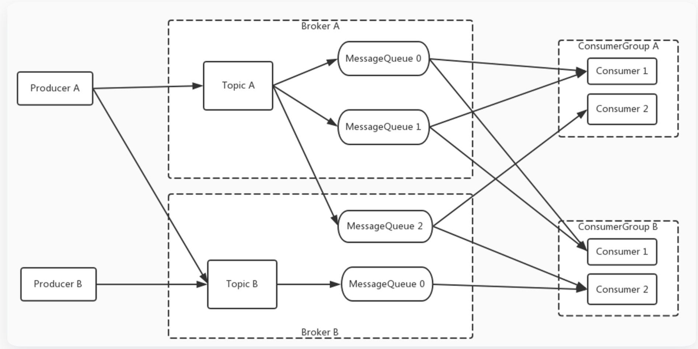

# RocketMQ源码学习

## 初识RocketMQ

[官网RocketMQ 架构 4.x](https://rocketmq.apache.org/zh/docs/4.x/introduction/02whatis)

- NameServer
    - 是一个简单的 Topic 路由注册中心，支持 Topic、Broker 的动态注册与发现
- Broker
    - 主要负责消息的存储、投递和查询以及服务高可用保证。
- 队列：
    - 为了消息写入能力的水平扩展，RocketMQ 对 Topic进行了分区，这种操作被称为队列（MessageQueue）。
- ConsumerGroup的概念：
    - 为了消费能力的水平扩展，ConsumerGroup的概念应运而生。

- 官网已经把RocketMQ概念讲的很清楚了，不在此处赘述，其他概念可移步官网。

### RocketMQ 消息模型
- 

# 参考文档：

官网

- [初识RocketMQ](https://rocketmq.apache.org/zh/docs/4.x/introduction/02whatis)

RocketMQ源码-程序猿阿越

- [RocketMQ4源码（一）NameServer](https://juejin.cn/post/7257307209721167930)

勇哥Java实战

- [勇哥Java实战-](https://javayong.cn/)

- [RocketMQ4.X 设计精要](https://mp.weixin.qq.com/s/aMSa5GKloN2_lsMHRpGiOA)

## 生产者、消费者

- springboot- 模块 : [rocketmq-test-zpf](rocketmq-test-zpf)
- 访问失败的问题 

`Send [3] times, still failed, cost connect to <10.101.251.30:10911> failed`
- 修改 broker.conf： 

`brokerIP1=10.24.99.61`
- 参考:
[Docker部署RocketMQ踩坑记录](https://www.cnblogs.com/kendoziyu/p/15210806.html)